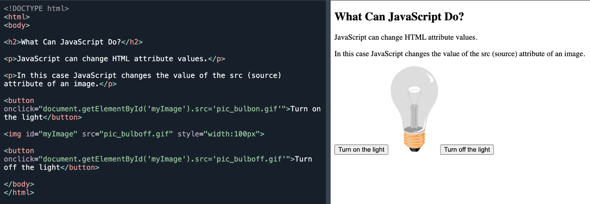

# ⚡ Marujeo del JavaScript ⚡

## Índice

 
  - [**Variables**](#variables)
  - [**Tipos de datos**](#tipos-de-datos)
  - [**typeOf**](#typeof)
  - [**Cambiar contenido HTML con getElementById()**](#cambiar-contenido-html-con-getelementbyid)
  - [**for**](#for)
  - [**while**](#while)
  - [**do while**](#do-while)
  - [**forEach**](#foreach)
  - [**for of**](#for-of)
  - [**for in**](#for-in)
  - [**break**](#break)
  - [**Arrays**](#arrays)
  - [**Métodos de Array**](#métodos-de-array)
  - [**Objetos**](#objetos)
  - [**Operador Rest y Spread**](#operador-rest-y-spread)
  - [**Funciones**](#funciones)
  - [**Clousure**](#clousure)
  - [**Asincronías**](#asincronías)
  - [**Arrow Fuctions**](#arrow-functions)
  - [**Condicionales**](#condicionales)
  - [**Window**](#window)
  - [**Template literal**](#template-literal)
  - [**Convertir a STRING o NUMBER**](#convertir-a-string-o-number)
---

## **Variables**
---

Las variables son cajas, contenedores donde guardar datos y se pueden cambiar por otros. Es quiere decir que es **mutable**.
Básicamente hay de dos tipos: `let` y `const`. También existe `var`, que hay que evitar.

**var** → Declara una variable en el *scope* global. 🚨 Evitar su uso!

**let** → Variable que podrá se le podrá reasignar un valor. Es de *scope* local, dentro de una función por ejemplo.

**const** → Variable de solo lectura. No es posible cambiar su valor. Su *scope* es local como el *let*. Usaremos siempre `const` por defecto a menos que sepamos que su valor va ha cambiar, ahí usaremos `let`.

## **Tipos de datos**
---

String → Secuencia de caracteres que representan un valor.
Number → Valor numérico.
Boolean → True o False.
Null → Valor nulo. JS es *case-sensitive*. No es lo mismo Null, que NULL o null.
Undefined → Valor sin definir.
Symbol → Tipo de datos cuyos casos son únicos e inmutables.
Object → Objeto. Y puede contener más variables en su interior.
Nan → Not A Number

## **typeOf**
---
El operador `typeOf`devuelve el tipo de dato del operando.
La llamada a `typeOf x` devuelve una cadena con el nombre del tipo:
```js
typeof undefined // "undefined"

typeof 0 // "number"

typeof 10n // "bigint"

typeof true // "boolean"

typeof "hola" // "string"

typeof Symbol("id") // "symbol"

typeof Math // "object"

typeof null // "object"

typeof alert // "function"

```
## **Cambiar contenido HTML con getElementById()**
---

getElementById() → El siguiente ejemplo "busca" un elemento HTML (con id="demo") y cambia el contenido del elemento (innerHTML) a "Hello JavaScript": 

`document.getElementById("demo").innerHTML = "Hello JavaScript";`

```js
<p id="demo">JavaScript can change HTML content.</p>

<button type="button" onclick='document.getElementById("demo").innerHTML = "Hello JavaScript!"'>Click Me!</button>

```


## **for**
---
Los *loops*, los necesitamos para crear un bucle tanta veces como queramos. Es habitual repetir acciones y de ahí los *loops*.

```js
for (inicio; condición; incremento){
    // instrucción
}
```
**inicio** → És una variable declarada que hará de contador.

**condición** → El *loop* se ejecuta mientras la condición se cumple.Determinará el número de veces que se ejecuta.

**incremento** → Actualiza el valor incrementando o reduciendo el contador.

**intrucción** → Mientras la *condición* sea `true`, se ejecutará la *intrucción*.


```js
for (let i = 0; i < 100; i++){
  console.log('hello world!')
}
```
```js
let alumnos = ['Pepe', 'Paco', 'Ana', 'Luisa', 'Juan'];
let contenido = "Lista de alumnos:\n";

for (let index = 0; index < alumnos.length; index++) {
    contenido += `${index} ${alumnos[index]} \n`;
};

console.log(contenido);
/*
Lista de alumnos:
0  Pepe 
1  Paco 
2  Ana 
3  Luisa 
4  Juan 
*/
```

```js
// Sumar los valores del 1 al 10
let suma = 0
for (let i = 1; i <= 10; i++) {
    suma += i
}
console.log(`La suma de los números del 1 al 10 es: ${suma}`) // 55
```

## **while**
---
Mientras la condición `condition` sea verdadera, el código del cuerpo del bucle será ejecutado.

```js
while (condition) {
  // Código
  // Llamada "cuerpo del bucle"
}
```

Por ejemplo, el bucle siguiente imprime `i` mientras se cumpla `i < 3`:

```js
let i = 0;
while (i < 3) { // Muestra 0, luego 1, luego 2
  alert( i );
  i++;
}
```

## **do while**
---
Similar a `while` solo que nos aseguramos que almenos de ejecute una vez.
```js
do {
  // cuerpo del bucle
} while (condition);
```

```js
let counter = 0

do {
    console.log('hello world!')
    counter++
} while (counter < 10) // Muestra 10 mensajes de "hello world!"
```
## **forEach**
----
`forEach` es un método de **array**, muy común, y sirve para recorrer un array sin escribir una estructura.
A menudo te verás con la necesidad de iterar a través de una colección de *arrays* y ejecutar un método *callback* por cada una de las iteraciones. Y para realizarlo hay un método muy útil: el método `forEach()`.

La función *callback* puede recibir tres parámetros.

- El elemento actual: Este es el elemento del arreglo por el cual se está haciendo la iteración.
- Su índice: Este es el índice de la posición que tiene el elemento dentro del array.
- El array objetivo: Este es el array por el cual se está haciendo la iteración.

🚨 Con `forEach` **NO** puedes terminar el bucle con la instrucción `break`.

```js
let alumnos = ['Pep', 'Cesc', 'Anna', 'Lluisa', 'Joan'];
let content = "Listado de alumnos:\n";

alumnos.forEach(function(alumno, position) {
    content += `${position} ${alumno} \n`;
})

console.log(content);

/*
Listado de alumnos:
0  Pep 
1  Cesc 
2  Anna 
3  Lluisa 
4  Joan 
*/
```
```js
let group = {
  title: "Our Group",
  students: ["John", "Pete", "Alice"],

  showList() {
    this.students.forEach(
      student => console.log(this.title + ': ' + student)
    );
  }
};

group.showList();

/* 
"Our Group: John"
"Our Group: Pete"
"Our Group: Alice"
*/
```

```js
let numeros = [3, 6, 8, 10, 12]
let impar = 3;

numeros.forEach(function(numero) {
    if (numero === impar) {
        numeros.shift() // 3 será borrado del arreglo
    }
})

console.log(numeros);

[6, 8, 10, 12] // Todos son pares!
```
En el siguiente ejemplo, vamos a ejecutar la función  `pasarLista` por cada  uno de los estudiantes por los que se recorre el bucle dentro del array. La función `pasarLista` solamente registra en la consola un *string* perteneciente a cada uno de los estudiantes.
```js
nombres = ["Anna", "Alicia", "Quim", "Guido", "Eva"]

function pasarLista(nombre, indice) {
    console.log(`Está el numero de estudiante ${indice + 1}  -${nombre} - presente? Sí!`)
    ;}

numeros.forEach((nombre, indice) => pasarLista(nombre, indice));


/*
"Está el número de estudiante 1  - Anna presente? Sí!"
"Está el número de estudiante 2  - Alicia presente? Sí!"
"Está el número de estudiante 3  - Quim presente? Sí!"
"Está el número de estudiante 4  - Guido presente? Sí!"
"Está el número de estudiante 5  - Eva presente? Sí!"
*/
```
## **for of**
----
`for...of` es otro método de iterar arrays. En este caso, no tenemos acceso al número de veces que hemos iterado, sólo al valor de cada elemento del array.
```js
let fruits = ["Apple", "Orange", "Plum"];

for (let fruit of fruits) {
  console.log( fruit );
}

/*
"Apple"
"Orange"
"Plum"
*/

```
## **for in**
----
`For...in` es un método en este caso para iterar objetos. Creará una variable que será la key de cada propiedad del objeto.

```js
let film = {title: 'El padrino', director: 'Francis Ford Coppola', year: 1972, score: 9}

for (let key in film) {
    console.log(`La key -> ${key} \nEl valor -> ${film[key]} `)
};

/*
La key -> title 
El valor -> El padrino 
La key -> director 
El valor -> Francis Ford Coppola 
La key -> year 
El valor -> 1972 
La key -> score 
El valor -> 9 
*/
```

## **break**
---
Normalmente, un loop continúa mientras la condición es truey se detendrá el bucle cuando la condición sea false.

Pero podemos forzar que se acabe el bucle utilizando la palabra `break`.

```js
let sum = 0;

while (true) {

  let value = Number(prompt("Enter a number", ''));

  if (!value) break;

  sum += value;

}
console.log( 'Sum: ' + sum );
```
## **Arrays**
---
Estructura de datos que nos permite almacenar múltiples valores en una misma estructura. Parecido a una lista. Se separa con `,` (comas)

Chuleta JavaScript - Array [link](https://www.tutorialesprogramacionya.com/herramientas/chuletajs/chuletamasejemplo.html#array) ← 🖱 *Click derecho - Abrir vínculo en una pestaña nueva.*

```js
const miArray = [ 'Laia', 4 ];
console.log(miArray); // [ 'Laia', 4 ]

const estudiantes = [ 'Pol', 'Anna', 'Joan', 'Èlia' ];
console.log(estudiantes); // [ 'Pol', 'Anna', 'Joan', 'Èlia' ]

const notas = [ 95, 67, 89, 56 ];
console.log(notas); // [ 95, 67, 89, 56 ]
```

### Array anidados

```js
const unNombre = [[], []];
```
```js
const listaEstudiantes = [['Daniel', 95],['Carmen', 97]];
console.log(listaEstudiantes) // [ [ 'Daniel', 95 ], [ 'Carmen', 97 ] ]
```
### Cambiar el valor de un Array

Para cambiar un valor dentro de una **array** se hace como si de una variable se tratára.

```js
const miArray = [ 10, 20, 30 ];
miArray[1] = 'Hola'; // <- Le damos el valor 'Hola' a la posición 1, que de inicio tenía 20.

console.log(miArray); // [ 10, 'Hola', 30 ]
```
Y podemos anidar Arrays en una posición.

```js
const miArray = [ 10, 20, 30 ];
miArray[1] = [ 1, 2, 3 ];

console.log(miArray); // [ 10, [ 1, 2, 3 ], 30 ]
```
### Acceso a Arrays multidimensionales (anidados)
Arrays que contienen otros Arrays.
```js
const miArray = [ [ 1, 2, 3 ],[4, 5, 6 ], [7, 8, 9 ] ];

/*
Array           [ [ 1, 2, 3 ],[4, 5, 6 ], [7, 8, 9 ] ]
Índices:               0          1           2
Índice internos:    0  1  2    0  1  2     0  1  2
*/

console.log(miArray[1]); // [ 4, 5, 6 ]

/* Para acceder al número 6 del Array en el índice 1 
o a la posición 0 del índice 2
*/

console.log(miArray[1][2]); // 6
console.log(miArray[2][0]); // 7
```

## **Métodos de Array**
---
**PUSH** → Añade uno o más elementos **al final** del array y retorna el número de elementos del array.
```js
const array1 = ['chirimoyas', 'manzanas', 'peras', 'sandias']
array1.push('naranjas')
console.log(array1) // [ 'chirimoyas', 'manzanas', 'peras', 'sandias', 'naranjas' ]

array1.push('limones', 'ciruelas')
console.log(array1) // [ 'chirimoyas', 'manzanas', 'peras', 'sandias', 'naranjas', 'limones', 'ciruelas' ]

const tamano = array1.push('kiwis') // OJO AQUÍ. 
console.log(tamano) // 8

const array2 = [1, 2, 3, 4, 5]
array2.push(10)
console.log(array2) // [ 1, 2, 3, 4, 5, 10 ]
```
**POP** → Elimina el último elemento del array y lo retorna. Si el array esta vacío luego retorna undefined.
```js
const miArray = [1, 2, 3, 4, 5, 6, 7, 8, 9, 10]
const ultimo = miArray.pop()
console.log(ultimo) // 10
console.log(miArray) // [1,2,3,4,5,6,7,8,9]
console.log(miArray.pop()) // 9 
console.log(miArray.length) // 8 
```
**SHIFT** → Elimina el primer elemento del array y lo retorna. Si el array esta vacío luego retorna undefined.

```js
let fruits = ["Apple", "Orange", "Pear"];

let firstFruit = fruits.shift(); // Apple

console.log( fruits ); // Orange, Pear
```

**UNSHIFT** → Añade uno o más elementos al inicio del array y retorna el número de elementos del array.
```js
const myArray = [1, 2, 3]
myArray.unshift(10, 20, 30)
console.log(myArray) // [10,20,30,1,2,3]

const cantElementos = myArray.unshift(100)
console.log(cantElementos) // 7
console.log(myArray) // [100,10,20,30,1,2,3]
```
**FIND** → Retorna el primer elemento del array que cumpla con la condición de la función que se pasa como parámetro.

```js
const frutas = [{
    nombre: 'Manzana',
    calorias: 68,
}, {
    nombre: 'Pera',
    calorias: 57,
}, {
    nombre: 'Sandia',
    calorias: 30,
}, {
    nombre: 'Melon',
    calorias: 36,
}, {
    nombre: 'Chirimoya',
    calorias: 40,
}, {
    nombre: 'Naranja',
    calorias: 40,
}]
console.log(frutas.find(fruta => fruta.nombre === 'Manzana')) // {nombre: 'Manzana', calorias: 68}
console.log(frutas.find(fruta => fruta.calorias === 40)) // {nombre: 'Chirimoya', calorias: 40}
```
**FOREACH** → Otra vez. Ejecuta la función para cada elemento del array en forma ascendente. La función recibe el valor, el índice y el arreglo.

```js
const colores=["rojo","verde","azul"]
colores.forEach((elemento,indice,array)=>{
    console.log(elemento,indice,array)
})
colores.forEach(elemento=>{
    console.log(elemento) // "rojo" "verde" "azul"
})
colores.forEach((elemento,indice,array)=>{
    array[indice]="amarillo"
})
console.log(colores) // ["amarillo", "amarillo", "amarillo"]
```
**MAP** → El método `map` aplica una función a cada elemento del array y retorna un nuevo array con el resultado.

- No modifica el array original
- **Retorna un nuevo array** con los resultados de aplicar la función que se pasa como parámetro a cada elemento del array.


SINTAXIS

```js
arr.map(callback(element, index, array));
```
```js
const numbers = [1, 5, 10, 15];
const resultMultiplyTwo = numbers.map(function(num) {
   return num * 2;
});

console.log(resultMultiplyTwo)// [2, 10, 20, 30]
console.log(numbers) // [1, 5, 10, 15]
```

```js
const numeros = [1, 4, 9];
const raizCuadrada = numeros.map(function(num) {
    return Math.sqrt(num);
});
// raizCuadrada es ahora [1, 2, 3]
// numeros siguen siendo [1, 4, 9]
```

O así, con `arrow function`

```js
const numeros = [1, 4, 9];
const raizCuadrada = numeros.map((num) => Math.sqrt(num));

console.log(raizCuadrada); // [1, 2, 3]
console.log(numeros); // [1, 4, 9]
```

Otro ejemplo: Esto añade el sufijo *man* a cada *prefijo*

```js
let prefijos = ["super", "spider", "ant", "iron"]
let sufijo = "man";

let nombresCompletos = prefijos.map(prefijo => prefijo + sufijo);

console.log(nombresCompletos);

// ["superman", "spiderman", "antman", "ironman"]
```

## **Objetos**
---
En JavaScript todo on objetos.

 ```js
let annualSalary = 30000
let months = 12

function getSalary (annualSalary, months) {
    return annualSalary / months
    
}

console.log(getSalary(annualSalary, months)) // 2500

// Recordatorio: Hace referencia a las variables. No tiene que coindicir con los nombre de los parámatros de la función.

 ```

Ejemplo de implementación OOP

```js
let employee = {
    annualSalary: 30000,
    months: 12,
    getSalary: function getSalary () {
        return this.annualSalary / this.months
    }
}
```


## **Operador Rest y Spread**
---

El operador **Rest** disponible en (JS ES6) sirve para recibir cualquier número de parámetros en una función en forma array.

Si lo declaramos en los *argumetos* de vuelve un array.
```js
function miFuncion(...args) { // args o cualquier otro nombre.
  console.log(args);
}

miFuncion(1, 2, 3, 4); // [1, 2, 3, 4]

```
O así:

```js
const miFuncion = (...args) => console.log(args);


miFuncion(1, 2, 3, 4);  // [1, 2, 3, 4]

```
Si lo declaramos en la función, realiza acciones dentro del array. Y descompone el array en sus elementos individuales y asignarlos en orden a los parámetros. Aplicado así este operador se llama **Spread**
```js
const numeros = [1, 2, 3];

const sumar = (x, y, z) => x + y + z;

// sumar(numeros[0],numeros[1],numeros[2] ); // <- Así sería la operación sin **rest**

console.log(sumar(...numeros)); // 6

```


## **Funciones**
---
`function` *nombreDeLaFuncion* seguido de `()`. Y entre las *curly braces* `{ }` pondremos las **instrucciones**.

Un a función es JavaScript es un OBJETO, de hecho, TODO en JS es un OBJETO y podemos acceder a ellos como tal.

```js
function sayHi() {
  console.log('Hello!')
}

sayHi() // "Hello!"

```

### Devuelven valores: `return`
Una función puede devolver un valor al código de llamada como resultado.

El ejemplo más simple sería una función que suma dos valores:

```js
function sum(a, b) {
  return a + b;
}

let result = sum(1, 2);
alert( result ); // 3
```
```js
function checkAge(age) {
  if (age > 18) {
    return true;
  } else {
    return confirm('¿Tienes permiso de tus padres?');
  }
}

let age = prompt('¿Qué edad tienes?', 18);

if ( checkAge(age) ) {
  alert( 'Acceso otorgado' );
} else {
  alert( 'Acceso denegado' );
}
```


🚨 Todo el código después del `return`, no se ejecutará. El `return` pone fin a la acción de la función.
```js
const value1 = 4
const value2 = 4

function average(){ 

   	let result
   	result = (value1 + value2) / 2 
   	return result
    result = 0 // <- Esta línea nunca se ejecutará.
}

const averageResult = average()
averageResult // 4
```

Para llamar a una **función anidada**, se usa el doble `()()`, de lo contrario no devuelve el valor que hay dentro.

```js
const a ='¡Hey! '
function global() {
  const b = '¿Qué'
  
  function local() {
    const c = ' tal?'
    return a + b + c
  }
  
  return local
}

global()() // '¡Hey! ¿Qué tal?'
```

## **Clousure**

Un **clousure** es una función autoejecutable que encapsula una serie de variables y deficiones locales que únicamente serán accesibles si son devueltas con el operador `return`. Esto permite tener, en cierto modo, *variables privadas*. O mejor dicho, menos accesibles desde fuera. Se usa cada vez menos desde la llegada de ES6 (ECMAScript v6)
Se usa con guión bajo `_abc` por convención. Hace referencia a la variable que no es accesible desde fuera.
```js
const miContador = function(){
  let _contador = 0
  
  function incrementar() {
    return _contador++
  }
  function decrementar() {
    return _contador--
  }
  function valor(){
    return _contador
  }
}
```
Para que funcione esto hay que englobar la función principal `miContador ` entre `()`, y para que se ejecute, colocamos otro juego de  `()` al final.

```js
const miContador = (function(){
  let _contador = 0
  
  function incrementar() {
    return _contador++
  }
  
  function decrementar() {
    return _contador--
  }
  
  function valor(){
    return _contador
  }
  
  return {
  incrementar,
  decrementar,
  valor
}
})()

miContador.valor() // 0
miContador.incrementar() //0
miContador.valor() // 1
```
## **Asincronías**

### Cargar un SCRIPT externo.

La función `loadScript(src)`, que carga un código script `src` dado.

Esto se llama *programación asincrónica “basado en callback”*. Una función que hace algo de forma asincrónica debería aceptar un argumento de callback donde ponemos la función por ejecutar después de que se complete.

```js
function loadScript(src, callback) {
  let script = document.createElement('script');
  script.src = src;
  script.onload = () => callback(script);
  document.head.append(script);
}

loadScript('https://cdnjs.cloudflare.com/ajax/libs/lodash.js/3.2.0/lodash.js', script => {
  alert(`Genial, el script ${script.src} está cargado`);
  alert( _ ); // _ es una función declarada en el script cargado
});
```

Ejemplo mejorado de `loadScript` con función de validación.
Para una carga exitosa llama a `callback(null, script)` y de lo contrario a `callback(error)`.

```js
function loadScript(src, callback) {
  let script = document.createElement('script');
  script.src = src;

  script.onload = () => callback(null, script);
  script.onerror = () => callback(new Error(`Error de carga de script con ${src}`));

  document.head.append(script);
}
```
### RESOLVE y REJECT

Los argumentos **resolve** y **reject** son *callbacks* proporcionadas por el propio JavaScript. Nuestro código solo está dentro del ejecutor.

Cuando el ejecutor, más tarde o más temprano, eso no importa, obtiene el resultado, debe llamar a una de estos callbacks:

- `resolve(value)` → Si el trabajo finalizó con éxito, con el resultado `value`.

- `reject(error)` → Si ocurrió un error, error es el objeto `error`.

Método antiguo

```js
const datos = [
  {
    id: 1,
    title: 'Iron Man',
    year: 2008
  },
  {
    id: 2,
    title: 'Spiderman',
    year: 2017
  },
  {
    id: 3,
    title: 'Avengers: Endgame',
    year: 2019
  }
]

//const getDatos = () => {
//return datos
//}
const getDatos = () => {
  return new Promise ((resolve, reject) => {
      setTimeout (() => {
        resolve (datos)
  }, 1500) // Tiempo de retardo que le damos a la funcion con setTimeout para simular un retraso de tiempo. En milisegundos.
  })
}

getDatos()
  .then((datos) => console.log(datos))


/*
Después de 1,5seg devuelve esto:
[
  { id: 1, title: 'Iron Man', year: 2008 },
  { id: 2, title: 'Spiderman', year: 2017 },
  { id: 3, title: 'Avengers: Endgame', year: 2019 }
]
*/  
```
Método moderno. Con `ASYNC AWAIT`. Es el más sencillo y utilizado en lugar de la promesas.

```js
const datos = [
  {
    id: 1,
    title: 'Iron Man',
    year: 2008
  },
  {
    id: 2,
    title: 'Spiderman',
    year: 2017
  },
  {
    id: 3,
    title: 'Avengers: Endgame',
    year: 2019
  }
]

const getDatos = () => {
  return new Promise ((resolve, reject) => {
      setTimeout (() => {
        resolve (datos)
  }, 1500) // Tiempo de retardo que le damos a la funcion con setTimeout para simular un retraso de tiempo. En milisegundos.
  })
}

async function fetchingData () {
  const datosFetched = await getDatos()
  onsole.log(datosFetched)
}

fetchingData()


/*
Después de 1,5seg devuelve esto:
[
  { id: 1, title: 'Iron Man', year: 2008 },
  { id: 2, title: 'Spiderman', year: 2017 },
  { id: 3, title: 'Avengers: Endgame', year: 2019 }
]
*/  
```
Y lo mismo, pero imprimiendo los objetos por separado, uno a uno.

```js
const datos = [
  {
    id: 1,
    title: 'Iron Man',
    year: 2008
  },
  {
    id: 2,
    title: 'Spiderman',
    year: 2017
  },
  {
    id: 3,
    title: 'Avengers: Endgame',
    year: 2019
  }
]

const getDatos = (i) => {
  return new Promise((resolve, reject) => {
      setTimeout(() => {
        resolve(datos[i])
      }, 1500) // Tiempo de retardo que le damos a la funcion con setTimeout para simular un retraso de tiempo. En milisegundos.
  })
}

(async () => {
  for (let i = 0; i < datos.length; i++) {

    console.log(await getDatos(i));
  }
})()
```
Otro ejemplo ASYNC AWAIT (simulando consulta en **MongoDB**)

```js
async function requestHandler(req, res) {
  
  try { // Intenta esto esto, y si no...(catch)

    const user = await User.findById(req.userId);
    const tasks = await Tasks.findById(user.tasksId);
    tasks.completed = true;
    await tasks.save();
    res.send('Task completed');

  }

  catch(err) { // Y si no... muestra el error

    res.send(err);

  }

}
```

## **Arrow Functions**
---
Las *arrow functions* permiten simplificar las funciones mejorando su expresividad.

Hay varias formas de crear una *arrow function*. Por ejemplo, podemos crear una *arrow function* sin necesidad de poner `()` después del `=` siempre y cuando la función no necesite parámetros o solo tenga uno.
Entonces, la siguiente función:
```js
function saludar (){
  const nombre = 'Quim';
  console.log('Hola');
}
saludar(); // "¡Hola Quim!"
```
Para crear una *arrow function*, primero quitamos la palabra `function` y como esta función únicamente tiene un parámetro, podemos obviar los `()` y colocar la constante `nombre` seguida del símbolo de la `a.f`, que es este, `=>`.

🚨 Si la `a.f` ocupa solo una línea, esta ya lleva implícito el `return`, por lo que no haría falta escribirlo. También podemos omitir las `{ }`.

```js
const saludar = nombre => console.log(`¡Hola ${nombre}!`);

saludar('Quim') // "¡Hola Quim!"
```

```js
const sumar = function (a,b){
  return a + b;  
}

console.log(sumar(5,5)); // 10
```
Y aquí tenemos lo mismo con una `arrow function`
La función tiene dos parámetros, y en este caso sí que debemos poner `()`, seguido de `=>` y la instrucción. Tampoco necesita `return` ni `{ }`.

```js
const sumar = (a,b) => a + b;

console.log(sumar(5,5)); // 10
```
🚨 Con las funciones de flecha no hay vinculación de `this`. Haría referencia a `Window` 

Más ejemplos...

```js
const concatenarArrays = function(arr1, arr2) {
  return arr1.concat(arr2);
};

console.log(concatenarArrays([1, 2], [3, 4, 5])); // [ 1, 2, 3, 4, 5 ]
```
Versión `a.f`
```js
const concatenarArrays = (arr1, arr2) => arr1.concat(arr2);

console.log(concatenarArrays([1, 2], [3, 4, 5])); // [ 1, 2, 3, 4, 5 ]
```

Y cuando la función ocupa varias líneas funciona de la siguiente manera:
```js
const sumar = function(a, b) {
  let num = 6;
  return a + b + num;
}

console.log(sumar(1,1)); // 8

```
En `a.f`.
```js
const sumar = (a, b) => {
  let num = 6;
  return a + b + num;
}

console.log(sumar(1,1)); // 8
```
Tunear un valor por defecto es posible, *look at this* ⬇

```js
const incrementar = (num, valor = 1) => num + valor;

console.log(incrementar(5, 3)); // <- Aquí le pasamos el valor 3, como nuevo valor (que era 1) y el resultado es 8
```

### THEN y CATCH

Un objeto Promise sirve como enlace entre el ejecutor y las funciones consumidoras, que recibirán un resultado o un error. Las funciones de consumo pueden registrarse utilizando los métodos `.then` y `.catch`. La llamada `.catch(f)` es un análogo completo de `.then(null, f)`, es solo una abreviatura, se usa habitualmente para llamar al *Mensaje de Error*

SINTAXIS

```js
promise.then(
  function(result) { /* manejar un resultado exitoso */ },
  function(error) { /* manejar un error */ }
);
```

El primer argumento de `.then` es una función que se ejecuta cuando se resuelve la promesa y recibe el resultado.

El segundo argumento de `.then` es una función que se ejecuta cuando se rechaza la promesa y recibe el error.

Por ejemplo, aquí hay una reacción a una promesa resuelta con éxito:
```js
let promise = new Promise(function(resolve, reject) {
  setTimeout(() => resolve("hecho!"), 1000);
});

// resolve ejecuta la primera función en .then
promise.then(
  result => alert(result), // muestra "hecho!" después de 1 segundo
  error => alert(error) // no se ejecuta
);
```

## **Window**
---
Podemos utilizar el **objeto especial** `Window` para acceder directamente al ámbito global del DOM independientemente de donde nos encontremos. Esto ocurre así porque las variables globales se almacenan dentro del objeto Window, es la ventana del navegador web.

```js
let a = 1;
console.log(a); // Aquí accedemos a la "a" global, que vale 1

function x() {
  console.log(a); // En esta línea el valor de "a" es 1
  a = 5; // Aquí creamos una variable "a" en el ámbito anterior

  console.log(a); // Aquí el valor de "a" es 5 (a nivel de función)
  console.log(window.a); // Aquí el valor de "a" es 5 (ámbito global)
}

x(); // Aquí se ejecuta el código de la función x()
console.log(a); // En esta línea el valor de "a" es 5

```
## **Template literal**
---
Ejemplo:
```js
let name = "Quim";
alert( `Hola, tu nombre es ${"name"}.`); // Hola, tu nombre es Quim.
```

## **Convertir a STRING o NUMBER**
---
Escribimos String, Number para covertir valores.

```js
let value = true;
alert(typeof value); // boolean

value = String(value); // ahora value es el string "true"
alert(typeof value); // string
```

Nota:
Los string "afectados" por un operador lógico serán convertidos a números.
```js
alert( "6" / "2" ); // 3, los strings son convertidos a números
```
##
